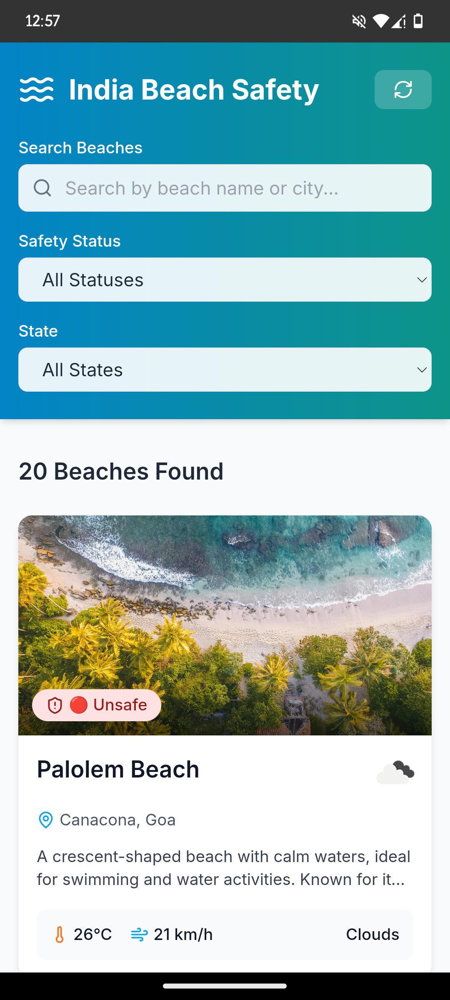
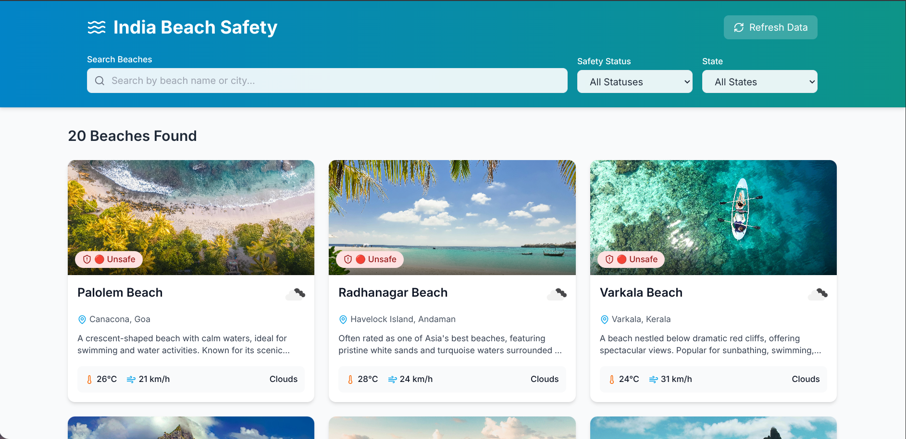
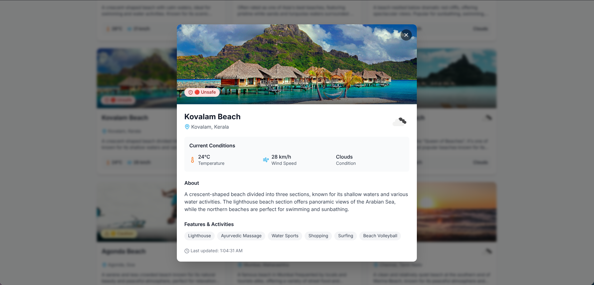

# 🌊 CoastalGuide - Your Real-Time Beach Weather Companion

[](https://reactjs.org/)
[](https://tailwindcss.com/)
[](https://greensock.com/gsap/)
[](https://vitejs.dev/)

**Live Site:** **[https://costalguide.onrender.com/](https://costalguide.onrender.com/)**

CoastalGuide is a beautifully designed, easy-to-use web application that provides crucial, real-time weather updates for famous beach locations across India. Its primary mission is to help beachgoers, tourists, and locals stay informed about coastal weather conditions, promoting safety and better planning for seaside activities.

---

### 🤔 Why CoastalGuide?

Coastal weather can be unpredictable. A sunny day can turn stormy in a matter of hours, posing risks to visitors. CoastalGuide was created to solve this problem by offering a centralized, simple, and aesthetically pleasing platform to check live weather conditions. No more guessing or relying on outdated forecasts—get the data you need, right when you need it.

---

### ✨ Core Features

* **⚡ Real-Time Weather Data:** Get live, up-to-the-minute weather information, including temperature, humidity, wind speed, and atmospheric conditions for various Indian beaches.
* **🔓 Instant & Open Access:** We believe safety information should be free and easy to access. That's why CoastalGuide requires **no user authentication or login**. Just visit the site and get the weather instantly.
* **💨 Fluid & Engaging UI:** The user interface is enhanced with subtle animations powered by **GSAP**, creating a smooth and enjoyable Browse experience.
* **🎨 Modern & Responsive Design:** Built from the ground up with **Tailwind CSS**, the application looks and works great on any device, whether you're on a desktop computer, tablet, or smartphone.

---

## 📲 Android App Available!

For the best mobile experience, we highly recommend our dedicated Android app. Get all the features of CoastalGuide optimized for your phone, with the convenience of an app icon right on your home screen.

<br>

<br>

### How to Install:

1.  Navigate to the **[Releases Section](https://github.com/saipuneeth2706/CostalGuide/releases)** of this GitHub repository.
2.  Download the latest `.apk` file.
3.  Open the file on your Android device and follow the on-screen instructions to install. (You may need to "allow installation from unknown sources" in your device settings).

---

### 📸 Application Screenshots

Here’s a sneak peek into the CoastalGuide web experience.

<br>

<p align="center">
    
    <em>The clean, welcoming, and intuitive home page.</em>
</p>

<br>

<p align="center">
    
    <em>Detailed, real-time weather information for a selected beach location.</em>
</p>

---

### 🛠️ Technology & Architecture

This project was built with a focus on performance, scalability, and modern development practices.

* **Framework:** [React](https://reactjs.org/) was chosen for its component-based architecture, which allows for reusable and manageable UI elements.
* **Styling:** [Tailwind CSS](https://tailwindcss.com/) provides a utility-first approach to styling, enabling rapid development and a highly customized design without writing traditional CSS.
* **Animations:** [GSAP (GreenSock Animation Platform)](https://greensock.com/gsap/) is a professional-grade animation library used to create high-performance animations that are impossible with CSS alone.
* **Build Tool:** [Vite](https://vitejs.dev/) offers a lightning-fast development server and optimized build process, significantly improving the developer experience.
* **Deployment:** The application is hosted on [Render](https://render.com/) for continuous deployment and reliable, hassle-free hosting.

---

### 🚀 Getting Started Locally

Interested in exploring the code or contributing? You can run the project on your local machine by following these steps.

1.  **Clone the Repository:**
    Open your terminal and run the following command to copy the project files to your computer.
    ```sh
    git clone [https://github.com/saipuneeth2706/CostalGuide.git](https://github.com/saipuneeth2706/CostalGuide.git)
    ```

2.  **Navigate to the Project Directory:**
    ```sh
    cd CostalGuide
    ```

3.  **Install Dependencies:**
    This command will install all the necessary Node.js packages defined in `package.json`.
    ```sh
    npm install
    ```

4.  **Start the Development Server:**
    This command will launch the application in development mode.
    ```sh
    npm run dev
    ```
    Once running, you can open your browser and navigate to `http://localhost:5173` (or the port specified in your terminal) to see the app live.

---

### 📜 License

This project is open-source and distributed under the **MIT License**. See the `LICENSE` file for more details. Feel free to fork, modify, and use it for your own projects!

